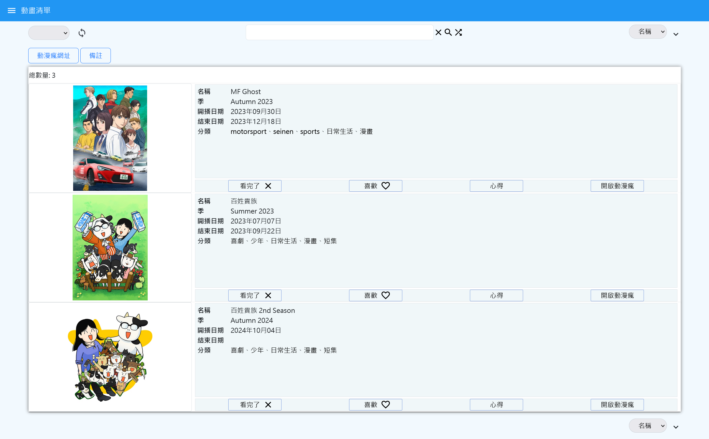
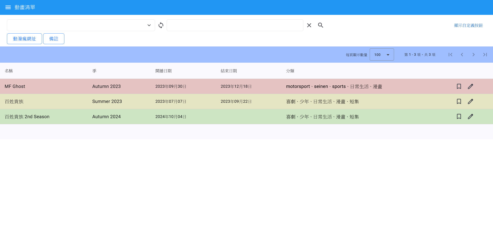

# 自定義清單系統

## 描述

這是一個來顯示清單的系統，需要配置清單主題、資料欄位、資料集，可以配置自定義設定來執行一些功能。
需搭配後端 [List Project Backend](https://github.com/les269/listProjectBackend)

## 目錄

- [使用方法](#使用方法)
- [配置](#配置)
- [呈現畫面](#呈現畫面)

## 使用方法

1. clone：
   ```bash
   git clone https://github.com/les269/list-project-angular.git
   ```
2. install：
   ```bash
   npm install
   ```
3. run
   ```bash
   nx serve
   ```

## 配置

- [清單列表](./public/md/list.md)
- [資料集群組](./public/md/dataset-group.md)
- [資料集](./public/md/dataset.md)
- [爬蟲設定清單](./public/md/scrapy.md)
- [API設定清單](./public/md/api.md)
- [替換文字清單](./public/md/replace-value-map.md)

配置順序為**爬蟲設定清單**或**API設定清單**因這跟資料獲取有關但也可以跳過不配置以全手動輸入的方式，再來配置**資料集群組**後再配置**資料集**，最後進行配置**清單列表**，而**替換文字清單**目前只有在爬蟲替換文字使用可不用配置。
| 配置階段 | 配置項目 | 描述 | 備註 |
| -------- | ------------ | ----------------- | ---------- |
| 資料獲取 | 爬蟲設定清單 | 設定爬蟲規則 | 可選 |
| | API設定清單 | 設定 API 請求方式 | 可選 |
| 資料組織 | 資料集群組 | 將資料分組 | |
| | 資料集 | 建立個別資料集 | |
| 清單生成 | 清單列表 | 生成最終清單 | |
| 資料處理 | 替換文字清單 | 進行資料替換 | 目前僅用於爬蟲 |

## 呈現畫面

- **圖片清單**
  

- **table表格**
  

## 新功能

| 新功能                                                     | 進度    | 備註 |
| ---------------------------------------------------------- | ------- | ---- |
| 可以import export各清單成json檔案 (優先度最低)             | pending |      |
| 是否可以讓angular跟spring包成一個執行檔案 (優先度最低)     | pending |      |
| 爬蟲,資料集群組,清單設定處理日期格式 (優先度最低)          | pending |      |
| 清單搜尋可以根據label勾選來配置autocomplete                | done    |      |
| 檔案或資料夾存在與否影響自定義是否可以使用或在前端可以得知 | done    |      |
| 刷新資料集前呼叫API                                        | done    |      |
| label 可使用替換表, 多一個store存替換表                    | cancel  |      |
| 刷新資料集會針對舊資料進行替換表更新                       | done    |      |
| 資料集可以用txt,csv讀檔以,分隔                             | done    |      |
| 取代舊版正式使用 轉移舊版資料至新版                        | doing   |      |
| 研究https 不會被瀏覽器認定不安全                           | pending |      |
| 刷新中 如何呈現給前端                                      | pending |      |

聯繫我(replay) : 6x8sckva7@mozmail.com
