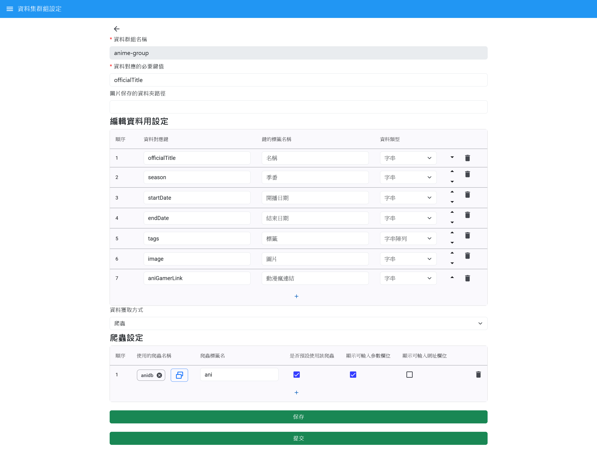
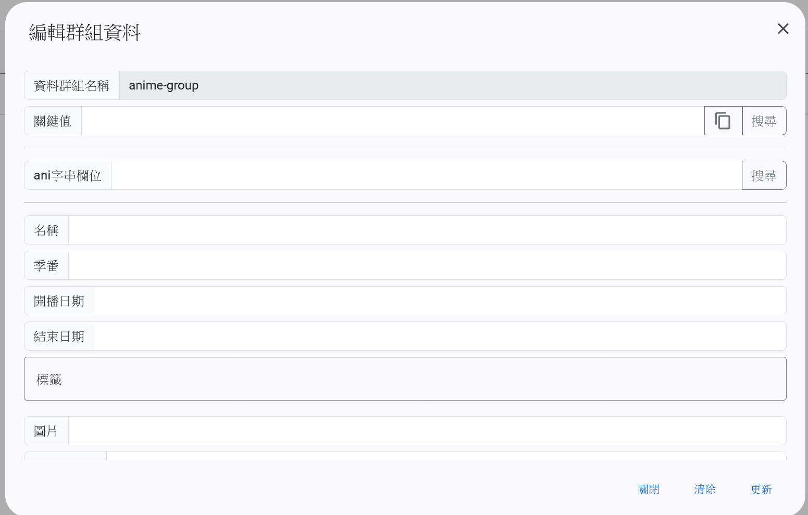

# 資料集群組清單

此頁面顯示 **資料集群組清單**，用於管理各資料集群組。資料集群組主要用於將單筆資料組合成多筆資料型態，便於後續資料處理與應用。

- **資料集群組**：每個集群組內包含多筆資料項目，可作為資料整理與分類的基礎。
- **清單操作**：支援新增、編輯及刪除資料集群組。

# 資料集群組設定

資料集群組的設定畫面主要包含以下必填項目和配置：

### 必填欄位

- **資料群組名稱**：輸入資料集群組的名稱。
- **資料對應的必要鍵**：設置資料的識別鍵。

### 圖片保存的資料夾路徑

- 在有需要自動下載圖片檔案時設定的資料夾路徑

### 資料編輯方式

- **手動編輯**：配置手動編輯資料所需的欄位。

### 資料獲取方式

#### 1. 爬蟲設定

- **爬蟲設定選擇**：需先在 **爬蟲設定清單** 新增設定後，才能選取。
- **是否預設使用**：設置該爬蟲是否作為自動抓取資料的方式。
- **顯示可輸入參數欄位**：可選擇顯示手動輸入的參數欄位。
- **顯示可輸入網址欄位**：手動輸入網址，直接使用爬蟲抓取資料。

#### 2. API 設定

- **API 設定清單**：需先在 API 設定清單中配置 API，並確保可直接正常呼叫使用也沒有問題的API。

# 編輯群組資料

- **關鍵值**：用來搜尋現有資料，方便快速查詢並更新，右邊按鈕可以直接開窗選取現有資料。
- **爬蟲設定區塊**：此區塊顯示可用的**爬蟲設定**，讓使用者可以直接選擇並新增或修改資料。需要在爬蟲設定中提前配置。

- **資料編輯區塊**：在 **資料編輯方式** 配置下，顯示相應的欄位，方便用戶手動修改資料內容。
