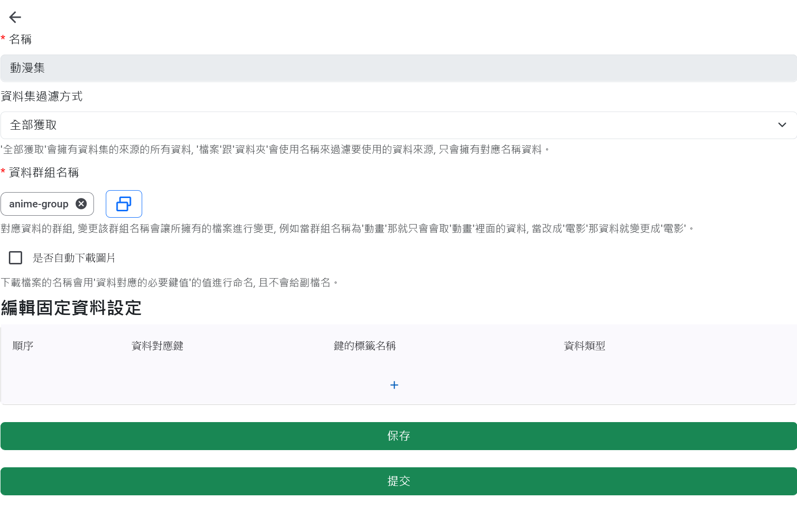

# 資料集清單

此頁面顯示 **資料集清單**，用於管理資料集。資料集主要拿取資料集群組的資料，當群組內資料有更新需使用刷新來更新該資料集。

# 資料集設定

資料集設定畫面主要包含以下必填項目和配置：

## 必填欄位

- **名稱**：輸入資料集的名稱。
- **資料群組名稱**：設置資料集所屬的資料群組。
- **資料集過濾方式**：提供三種過濾方式：
  - **全部獲取**: 獲得群組全部檔案並不會自動爬蟲。
  - **檔案名稱**: 使用檔案名稱進行爬蟲並結果更新至群組全部，已存在群組的資料並不會重複爬取。
  - **資料夾名稱**: 使用資料夾名稱進行爬蟲並結果更新至群組全部，已存在群組的資料並不會重複爬取。

## 是否自動下載圖片

- 當需要自動下載圖片檔案時，勾選此選項並輸入對應的鍵值。

## 編輯固定資料設定

此部分主要配置四種資料類型：

- **固定字串**：輸入所需的固定字串。
- **檔案全名**：獲取檔案的完整名稱。
- **檔案大小**：獲取檔案的大小。
- **資料路徑**：獲取資料的路徑。
